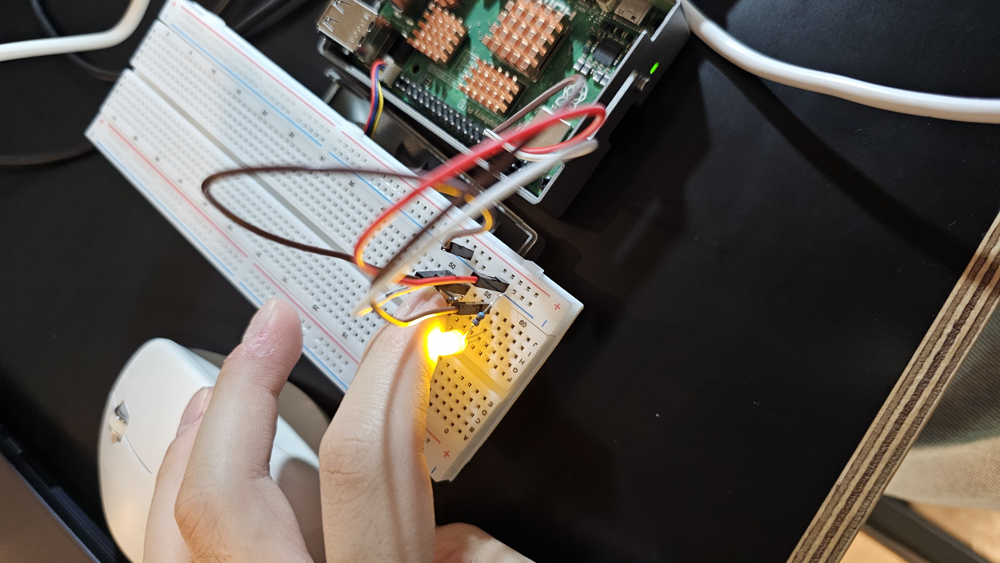
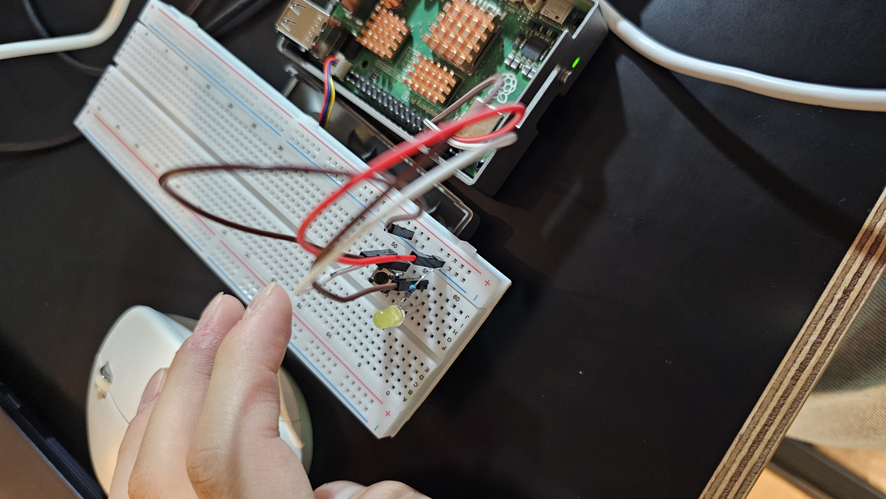

# IoT26-HW02 Team C (Cho Wooyoung, Seol Jaemin, Lim Youbin)

Since this assignment covers the fundamentals, we each decided to implement/practice the code individually to ensure a clear understanding of the Raspberry Pi GPIO control. As a result, there are three variations of code, performing the same
core task.

## Result

### Photos

### Videos
[HW2_webm.webm](https://github.com/user-attachments/assets/5e4d120d-828b-4199-9454-45e7a3096ff4)

The demo video can be found in 'results/HW2.mp4'.
